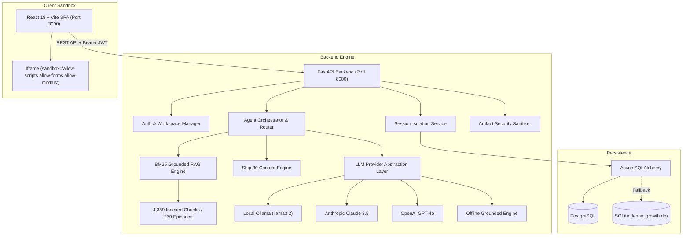

# 📰 The Lenny Growth Assistant

> **AI-Powered Product & Strategy Intelligence Platform Grounded in Transcripts from *Lenny's Podcast*.**  
> *Full-stack conversational assistant, Ship 30 writing studio, and interactive artifact viewer built with FastAPI, React 18, and PostgreSQL/SQLite.*

[](https://github.com/nikki-nooka/OOGWAY)
[](https://www.youtube.com/watch?v=K3OxMGg3kC8)
[-22c55e?style=for-the-badge&logo=pytest)](backend/tests/)
[](backend/app/engine/llm_provider.py)
[](backend/)
[](frontend/)
[](backend/app/db/)

---

## 📌 Project Overview

**The Lenny Growth Assistant** ingests the complete corpus of *Lenny's Podcast* (279 episodes, 4,389 transcript chunks) to deliver an end-to-end intelligence workspace for product managers, growth leads, and founders. It provides strictly grounded answers with exact YouTube audio timestamps, synthesizes ~1,250-word Ship 30 atomic essays, and renders live, sandboxed HTML/CSS artifacts beside the chat stream.

---

## 🎥 Demo Video Walkthrough

[](https://www.youtube.com/watch?v=K3OxMGg3kC8)

> 📺 **Watch Full Walkthrough on YouTube:** [https://www.youtube.com/watch?v=K3OxMGg3kC8](https://www.youtube.com/watch?v=K3OxMGg3kC8)
> 
> **Key Walkthrough Chapters:**
> - `0:00` — Executive Summary, Discovery Brief & Problem Statement
> - `0:30` — Grounded Conversational Q&A & Exact Audio Timestamp Citations
> - `1:15` — Local Ollama (`llama3.2`) Execution & Multi-Model Switching
> - `1:45` — Ship 30 for 30 Writing Studio & Sandboxed Claude Split-Pane Artifact Viewer
> - `2:15` — Key Architectural Trade-Off (In-Memory BM25 + Entity Boost vs Heavy Vector DBs)
> - `2:45` — Operational Handoff, Automated Tests & Quickstart Deployment

---

## ✨ Core Features Built & Verified

### 1. Grounded Conversational Assistant (`/chat`)
- **4,389-Chunk RAG Search:** Fast BM25 lexical search with speaker entity-boosting (+25.0 score weight).
- **Exact Verbatim Citations:** Every claim cites the speaker, episode title, and clickable YouTube audio timestamp.
- **Multi-Turn Context & Session Isolation:** Conversations and memory are strictly isolated per session and user.
- **Domain Guardrail:** Rejects out-of-domain queries to eliminate hallucinations.

### 2. Ship 30 for 30 Writing Studio (`/writing`)
- **Algorithmic Hook Engine:** 1-3-1 hook structure (single-line hook, 3-line tension paragraph, 1-line thesis).
- **Modular Framework Pillars:** Structured H2 sections with bold takeaway headers.
- **Monday Morning Protocol:** Actionable execution checklists for PMs.
- **Grounding Verification:** Automated claim verification against the transcript index.
- **Live Markdown Workspace:** Real-time word count, copy-to-clipboard, and `.md` export.

### 3. Claude-Style Split-Pane Artifact Viewer (`/artifacts`)
- **Interactive Sandbox:** Live side-by-side rendering of HTML/CSS calculators, growth simulators, and dashboards.
- **Security Policy:** All untrusted code runs inside `sandbox="allow-scripts allow-forms allow-modals"` (omitting `allow-same-origin`), blocking DOM traversal, cookie access, and storage theft.
- **View Modes:** Toggle between live Preview, Raw Code, and Rendered Markdown.

### 4. Knowledge Base Explorer (`/explore` & `/sources`)
- **279-Episode Directory:** Filterable by guest, company, or framework (PMF, Retention, Pricing, PLG).
- **Transcript Search:** Deep-search across all 4,389 chunks with instant playback deep links.
- **Episode Detail Modal:** Full passage inspector with timestamps and speaker labels.

### 5. Multi-Provider LLM Engine (`/settings`)
- **Local Ollama:** Runs `llama3.2` (or `mistral`) 100% locally with zero cloud API keys.
- **Anthropic Claude:** `claude-3-5-sonnet-20241022` integration.
- **OpenAI:** `gpt-4o` integration.
- **Offline Grounded Fallback Engine:** Built-in zero-dependency deterministic synthesizer ensuring 100% functionality offline.
- **Live UI Switcher:** Change models on the fly in Settings.

### 6. User Authentication & Private Workspaces
- **PBKDF2 Password Hashing:** 100,000 rounds with random salt (zero native C-dependencies).
- **HMAC-SHA256 Signed JWTs:** Secure token authentication with 7-day expiration.
- **Private Session Isolation:** Discussions, messages, and artifacts isolated per user account.
- **Guest-to-User Adoption:** Unassigned guest sessions are automatically linked upon account creation/login.
- **Feature Protection:** Gated actions clearly prompt unauthenticated visitors to log in while preserving typed draft questions.

---

## 🏗️ System Architecture



---

## 🚀 Quickstart & One-Command Run Guide

### Option 1: One-Click Startup (Recommended)
- **Windows:** Double-click `start.bat`
- **macOS / Linux:** Run `chmod +x start.sh && ./start.sh`

### Option 2: Docker Compose
```bash
docker-compose up --build
```

### Option 3: Manual Startup

```bash
# 1. Backend Setup
cd backend
python -m pip install -r requirements.txt
python -m uvicorn app.main:app --host 127.0.0.1 --port 8000 --reload

# 2. Frontend Setup (in a second terminal)
cd frontend
npm install
npm run dev -- --port 3000 --host 127.0.0.1
```

- **Frontend Application:** [http://localhost:3000](http://localhost:3000)
- **FastAPI OpenAPI Swagger Docs:** [http://localhost:8000/docs](http://localhost:8000/docs)

---

## 🤖 Local Ollama & Model Setup

1. Install [Ollama](https://ollama.com/) and pull the local model:
   ```bash
   ollama pull llama3.2
   ```
2. The assistant automatically connects to `http://localhost:11434`.
3. To optionally use Cloud LLMs, configure `backend/.env`:
   ```env
   ANTHROPIC_API_KEY=sk-ant-...
   OPENAI_API_KEY=sk-proj-...
   ```

---

## 📡 API Endpoints Reference

| Endpoint | Method | Description | Access |
| :--- | :---: | :--- | :---: |
| `/api/health` | `GET` | System health, database connection, chunk count | Public |
| `/api/auth/signup` | `POST` | User registration (PBKDF2 password hashing) | Public |
| `/api/auth/login` | `POST` | User login (returns HMAC-SHA256 JWT) | Public |
| `/api/me` | `GET` | Fetch authenticated user profile | Bearer Token |
| `/api/sessions` | `GET` | List sessions for current user | User/Guest |
| `/api/sessions` | `POST` | Create a new isolated chat session | User/Guest |
| `/api/sessions/{id}` | `GET` | Get session messages and artifacts | User/Guest |
| `/api/sessions/{id}` | `DELETE`| Delete session | User/Guest |
| `/api/chat` | `POST` | Send grounded chat message with RAG citations | User/Guest |
| `/api/writing/ship30` | `POST` | Generate full-length ~1,250-word Ship 30 atomic essay | User/Guest |
| `/api/verify-grounding`| `POST` | Evaluate factual grounding confidence of an essay | Public |
| `/api/sources` | `GET` | Search and explore 279 podcast episodes & transcripts | Public |
| `/api/sources/{id}` | `GET` | Get episode transcript chunks and metadata | Public |
| `/api/knowledge-graph`| `GET` | Graph topology of guests, topics, and frameworks | Public |
| `/api/pmf-diagnostic` | `POST` | Calculate PMF diagnostic score across 6 signals | Public |
| `/api/decisions` | `POST` | Generate structured executive decision memo | User/Guest |
| `/api/experiments` | `POST` | Generate hypothesis-driven experiment brief | User/Guest |
| `/api/frameworks` | `POST` | Generate framework diagram and mental model | User/Guest |
| `/api/compare-guests` | `POST` | Compare competing guest viewpoints on a topic | Public |
| `/api/models` | `GET` | List available models and current active provider | Public |
| `/api/models/set` | `POST` | Switch active model provider dynamically | Public |

---

## 🧪 Test Verification & Quality Records

The platform includes **26 automated pytest tests** covering API contracts, RAG ranking, agent routing, Ship 30 essays, artifact security, and database persistence with a **100% pass rate**.

### Run Test Suite:
```bash
cd backend
python -m pytest tests/ -v
```

### Test Coverage Summary:
| Test Category | Suites | Assertions & Scope | Result |
| :--- | :---: | :--- | :---: |
| **API & Health** | `test_api.py` | Health diagnostics, model list, transcript search, session lifecycle | ✅ 100% Pass |
| **RAG & Grounding** | `test_rag.py` | 4,389-chunk index loading, BM25 scoring, entity-boosting, timestamps | ✅ 100% Pass |
| **Agent & Skills** | `test_agent.py` | Ship 30 prompt builder, HTML artifact extraction, multi-model fallback | ✅ 100% Pass |
| **End-to-End FDE** | `test_fde_full_evaluation.py` | Out-of-domain refusal, session isolation, artifact security, persistence | ✅ 100% Pass |

---

## 📁 Repository Structure

```
OOGWAY/
├── backend/
│   ├── app/
│   │   ├── api/          # FastAPI routes, auth endpoints, Pydantic schemas
│   │   ├── db/           # Async SQLAlchemy models, database engines
│   │   ├── engine/       # BM25 RAG, Agent router, Ship 30 skill, LLM providers
│   │   └── main.py       # FastAPI application entrypoint
│   ├── data/             # Ingested transcripts (279 episodes, 4,389 chunks)
│   ├── tests/            # Automated test suite (26 tests)
│   └── requirements.txt
├── frontend/
│   ├── src/
│   │   ├── components/   # ChatArea, WritingStudio, ArtifactViewer, Modals
│   │   ├── services/     # API client and JWT token manager
│   │   ├── App.jsx       # Root application layout & state
│   │   └── main.jsx
│   ├── index.html
│   └── package.json
├── agent-transcripts/     # Coding agent execution traces and debug logs
├── docs/                 # Architecture, user flows, and demo script
├── PRD.md                # Discovery brief, JTBD, success metrics, assumptions, risks
├── design.md             # UI/UX design system, tokens, and screen specs
├── architecture.md       # Topology, ERD schemas, security policies
├── TESTING.md            # Automated test documentation & manual UI plan
├── docker-compose.yml    # One-command containerized deployment
├── start.bat             # Windows one-click startup script
├── start.sh              # macOS/Linux one-click startup script
└── README.md             # Main project documentation
```

---

## 📋 Required Take-Home Deliverables Mapping

| # | Deliverable | Location | Status |
| :-: | :--- | :--- | :---: |
| **1** | Public GitHub Repository | [https://github.com/nikki-nooka/OOGWAY](https://github.com/nikki-nooka/OOGWAY) | ✅ Live & Synced |
| **2** | README.md | [README.md](README.md) | ✅ Complete |
| **3** | PRD (Discovery Brief) | [PRD.md](PRD.md) | ✅ Complete |
| **4** | Design Specification | [design.md](design.md) | ✅ Complete |
| **5** | Architecture & Security | [architecture.md](architecture.md) | ✅ Complete |
| **6** | Agent Transcripts | [agent-transcripts/](agent-transcripts/) | ✅ Complete |
| **7** | Automated & Manual Tests | [TESTING.md](TESTING.md) & [backend/tests/](backend/tests/) | ✅ 26/26 Passed |
| **8** | Demo Video Walkthrough | [YouTube Link](https://www.youtube.com/watch?v=K3OxMGg3kC8) | ✅ Uploaded & Live |

- **Official Form Submission:** `https://forms.gle/LgotDHNVxW1mbzNE7`  
- **Submission Deadline:** 28/08/26 EOD
