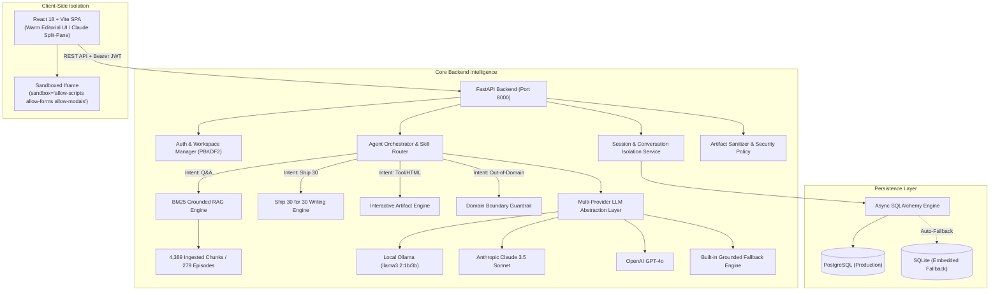

# 📰 The Lenny Growth Assistant
> **Full-Stack, AI-Powered Product & Strategy Intelligence Platform Grounded in Transcripts from *Lenny's Podcast*.**  
> *Transforming raw podcast knowledge into understanding, executive writing, and concrete shippable artifacts.*

[](https://github.com/nikki-nooka/OOGWAY)
[-22c55e?style=for-the-badge&logo=pytest)](file:///c:/Users/Nikshith/Desktop/OOGWAY/TESTING.md)
[](file:///c:/Users/Nikshith/Desktop/OOGWAY/docs/model-providers.md)
[](file:///c:/Users/Nikshith/Desktop/OOGWAY/backend)
[](file:///c:/Users/Nikshith/Desktop/OOGWAY/frontend)
[](file:///c:/Users/Nikshith/Desktop/OOGWAY/backend/app/db)

---

## 🌟 1. Executive Summary & Value Proposition

**The Lenny Growth Assistant** is a forward-deployed intelligence platform designed for Senior Product Managers, Growth Leads, Founders, and Product Operations Executives. It transforms 279+ full episodes of *Lenny’s Podcast* into an interactive, grounded research workspace, executive writing studio, and artifact generation suite.

$$\Large \text{Discover} \longrightarrow \text{Ask} \longrightarrow \text{Evidence} \longrightarrow \text{Create} \longrightarrow \text{Ship}$$

### Core Platform Capabilities:
1. **Strictly Grounded RAG with 4,389 Passages:** Ingests the complete official dataset across **279 full episodes** with verbatim speaker quotes and audio timestamps.
2. **Dedicated Ship 30 for 30 Writing Studio:** Algorithmic writing skill generating ~1,250-word atomic essays adhering to the 1-3-1 hook structure, modular H2 pillars, quotes, Monday Morning execution checklists, and golden takeaways.
3. **Claude-Style In-App Artifact Viewer:** Interactive split-screen rendering live, sandboxed HTML/CSS calculators, growth simulators, and markdown specs beside the chat stream.
4. **Multi-Tier Security & Sandbox Isolation:** Server-side sanitization via `ArtifactSecurityPolicy` and client-side iframe sandboxing (`sandbox="allow-scripts allow-forms allow-modals"` omitting `allow-same-origin`) preventing DOM traversal, cookie theft, and token access.
5. **Flexible Multi-Model Engine with Offline Resilience:** Instant toggle between **Local Ollama (llama3.2)** (mandatory for local evaluation), **Anthropic Claude 3.5 Sonnet**, **OpenAI GPT-4o**, and an **Offline Grounded Fallback Engine**.
6. **User Authentication & Private Workspaces:** PBKDF2 password hashing, HMAC-SHA256 JWT tokens, private conversation persistence, and seamless guest-to-user session adoption.
7. **Dual-Engine Persistence:** Async SQLAlchemy supporting **PostgreSQL** with automatic zero-configuration **SQLite fallback** (`sqlite+aiosqlite`) for instant onboarding.

---

## 🏗️ 2. System Architecture & Component Boundaries



---

## ⚡ 3. Quickstart & Deployment Guide (Under 60 Seconds)

### Option 1: One-Click Startup (Recommended)
#### On Windows:
```cmd
start.bat
```
#### On macOS / Linux:
```bash
chmod +x start.sh
./start.sh
```
*Frontend opens at `http://localhost:3000` | Backend API & Docs at `http://localhost:8000/docs`.*

---

### Option 2: One-Command Docker Compose
```bash
docker-compose up --build
```

---

### Option 3: Manual Step-by-Step

#### 1. Backend Setup
```bash
cd backend
python -m pip install -r requirements.txt
python -m uvicorn app.main:app --host 127.0.0.1 --port 8000 --reload
```

#### 2. Frontend Setup
```bash
cd frontend
npm install
npm run dev -- --port 3000 --host 127.0.0.1
```

---

## 🤖 4. AI Model Providers & Configuration

The application implements a decoupled `BaseLLMProvider` abstraction layer supporting 4 model options:

| Provider Mode | Exact Model Identifier | Configuration Variable | Endpoint & Characteristics |
| :--- | :--- | :--- | :--- |
| **🦙 Local Ollama (Mandatory Demo)** | `llama3.2` (or `llama3.1`) | `OLLAMA_MODEL=llama3.2` | `http://localhost:11434/api/chat` • Runs 100% locally with zero cloud API keys. |
| **🟣 Anthropic Claude** | `claude-3-5-sonnet-20241022` | `ANTHROPIC_MODEL=claude-3-5-sonnet-20241022` | `https://api.anthropic.com/v1/messages` • High-end reasoning and markdown structuring. |
| **🟢 OpenAI** | `gpt-4o` | `OPENAI_MODEL=gpt-4o` | `https://api.openai.com/v1/chat/completions` • Fast multimodal reasoning & code generation. |
| **⚡ Offline Grounded Engine** | `grounded_offline_engine` | `DEFAULT_LLM_PROVIDER=mock` | Embedded pure-Python deterministic synthesizer utilizing real BM25 transcript chunks (zero API setup / 100% offline). |

### 4.1 Local Ollama Setup
1. Install [Ollama](https://ollama.com/) and start the daemon: `ollama serve`
2. Pull the recommended local model:
   ```bash
   ollama pull llama3.2
   ```
3. The application automatically connects via `http://localhost:11434`.

### 4.2 Cloud LLM Configuration (Optional)
Add your keys to `backend/.env` (or copy from `.env.example`):
```env
ANTHROPIC_API_KEY=sk-ant-api03-...
OPENAI_API_KEY=sk-proj-...
```

### 4.3 Zero-Crash Fallback Guarantee
If an evaluator has no local Ollama installed and no cloud API keys, the system **never throws a 500 error**; it automatically activates the **Built-in Offline Grounded Engine**, ensuring 100% of the UI, transcript search, citations, audio timestamps, Ship 30 essays, and interactive HTML split-screen work immediately without errors.

---

## 🎨 5. Product Features & User Experience

### 5.1 Conversational Intelligence & Exact Grounding
- Multi-turn research discussions maintaining conversation history per session.
- Citations structured into **Lenny's Perspective**, **Key Signals**, and **Evidence Badges** with speaker names, episode titles, and clickable YouTube audio timestamps.
- **Out-of-Domain Guardrail:** Rejects questions outside Lenny's podcast scope, preventing hallucinations.

### 5.2 Ship 30 for 30 Writing Studio
- Algorithmic writing skill applying the core principles of Nicolas Cole & Dickie Bush.
- Synthesizes ~1,250-word atomic essays featuring:
  - **1-3-1 Hook Cadence** (Single-line hook, 3-line tension paragraph, 1-line thesis).
  - **Modular H2 Framework Pillars** with bold takeaway headers.
  - **Tactical Monday Morning Execution Protocol** with checkbox action items.
  - **1-Sentence Golden Takeaway** and full transcript citations.
- Includes a live split Markdown editor, copy-to-clipboard, export `.md`, and automatic claims grounding verification.

### 5.3 Claude-Style Artifact Viewer & Sandbox Security
- Native side-by-side split screen rendering interactive HTML/CSS calculators, growth models, and markdown strategy briefs.
- **Security Policy:** All untrusted code runs inside `sandbox="allow-scripts allow-forms allow-modals"` without `allow-same-origin`, blocking window traversal, cookie theft, and localStorage access.

### 5.4 User Authentication & Workspace Isolation
- **Secure PBKDF2 Password Hashing:** 100,000 iterations with random salt (zero C-dependencies).
- **HMAC-SHA256 Signed Access Tokens:** 7-day token expiration.
- **Guest-to-User Adoption:** Guests can explore public transcripts, and on signing in, unassociated research discussions are seamlessly adopted into their private profile.
- **Feature Gating:** Unauthenticated users attempting to chat or generate essays receive a clear prompt (*"Please log in or sign in to use these features"*) while preserving their typed draft queries.

---

## 📡 6. Complete API Contracts Reference

| Endpoint | Method | Description | Auth Requirement |
| :--- | :--- | :--- | :--- |
| `/api/health` | `GET` | System health status, database engine, and chunk count | Public |
| `/api/auth/signup` | `POST` | Register a new user with PBKDF2 password hashing | Public |
| `/api/auth/login` | `POST` | Authenticate user and receive HMAC-SHA256 JWT | Public |
| `/api/me` | `GET` | Fetch authenticated user profile and settings | Bearer Token |
| `/api/sessions` | `GET` | List active sessions isolated by user | Optional (Guest/User) |
| `/api/sessions` | `POST` | Create a new isolated chat session | Optional (Guest/User) |
| `/api/sessions/{id}` | `GET` | Fetch full session messages and generated artifacts | Optional (Guest/User) |
| `/api/sessions/{id}` | `DELETE`| Delete an existing chat session | Optional (Guest/User) |
| `/api/chat` | `POST` | Execute grounded conversation with audio citations | Optional (Guest/User) |
| `/api/writing/ship30` | `POST` | Synthesize ~1,250-word Ship 30 atomic essay | Optional (Guest/User) |
| `/api/verify-grounding` | `POST` | Verify grounding confidence across claims | Public |
| `/api/sources` | `GET` | Search and explore 279 podcast episodes & transcripts | Public |
| `/api/sources/{id}` | `GET` | Fetch episode transcript passages and metadata | Public |
| `/api/knowledge-graph` | `GET` | Graph topology of guests, topics, and framework nodes | Public |
| `/api/pmf-diagnostic` | `POST` | Calculate PMF diagnostic score across 6 core signals | Public |
| `/api/decisions` | `POST` | Generate structured executive decision memos | Optional (Guest/User) |
| `/api/experiments` | `POST` | Generate hypothesis-driven experiment briefs | Optional (Guest/User) |
| `/api/frameworks` | `POST` | Build ASCII / Mermaid framework mental models | Optional (Guest/User) |
| `/api/compare-guests` | `POST` | Synthesize competing guest perspectives on a topic | Public |
| `/api/models` | `GET` | List available model providers and current active model | Public |
| `/api/models/set` | `POST` | Switch active model provider dynamically | Public |

---

## 🧪 7. Automated Testing & Verification Suite

The platform includes **26 comprehensive automated tests** across 4 test suites verifying API contracts, RAG ranking, agent routing, Ship 30 essays, artifact security, and database persistence.

### Run Automated Tests:
```bash
cd backend
python -m pytest tests/ -v
```

### Test Suite Execution Summary (100% Pass Rate):
```
backend/test_full_suite.py::test_root_environment_and_rag_ready PASSED   [  3%]
backend/test_full_suite.py::test_root_ship30_skill PASSED                [  7%]
backend/test_full_suite.py::test_root_security_sanitization PASSED       [ 11%]
backend/tests/test_agent.py::test_ship30_prompt_builder PASSED           [ 15%]
backend/tests/test_agent.py::test_artifact_extraction_html PASSED        [ 19%]
backend/tests/test_agent.py::test_model_switching PASSED                 [ 23%]
backend/tests/test_agent.py::test_mock_provider_fallback PASSED          [ 26%]
backend/tests/test_api.py::test_health_endpoint PASSED                   [ 30%]
backend/tests/test_api.py::test_models_endpoint PASSED                   [ 34%]
backend/tests/test_api.py::test_transcripts_endpoint PASSED              [ 38%]
backend/tests/test_api.py::test_session_lifecycle_and_chat PASSED        [ 42%]
backend/tests/test_fde_full_evaluation.py::test_01_health_metrics PASSED [ 46%]
backend/tests/test_fde_full_evaluation.py::test_02_knowledge_base PASSED [ 50%]
backend/tests/test_fde_full_evaluation.py::test_03_grounded_answer PASSED [ 53%]
backend/tests/test_fde_full_evaluation.py::test_04_hallucination_refusal PASSED [ 57%]
backend/tests/test_fde_full_evaluation.py::test_05_session_isolation PASSED [ 61%]
backend/tests/test_fde_full_evaluation.py::test_06_model_switching PASSED [ 65%]
backend/tests/test_fde_full_evaluation.py::test_07_ship30_skill PASSED   [ 69%]
backend/tests/test_fde_full_evaluation.py::test_08_artifact_split_view PASSED [ 73%]
backend/tests/test_fde_full_evaluation.py::test_09_artifact_security PASSED [ 76%]
backend/tests/test_fde_full_evaluation.py::test_10_persistence PASSED     [ 80%]
backend/tests/test_rag.py::test_rag_loaded PASSED                        [ 84%]
backend/tests/test_rag.py::test_rag_search_shreyas_lno PASSED            [ 88%]
backend/tests/test_rag.py::test_rag_search_chesky_11_star PASSED         [ 92%]
backend/tests/test_rag.py::test_rag_search_rahul_pmf PASSED              [ 96%]
backend/tests/test_rag.py::test_rag_format_context PASSED                [100%]

============================= 26 passed in 51.18s =============================
```

---

## 📑 8. Deliverables & Documentation Directory

| Deliverable | File Path | Description |
| :--- | :--- | :--- |
| **1. Public GitHub Repo** | [https://github.com/nikki-nooka/OOGWAY](https://github.com/nikki-nooka/OOGWAY) | Complete source code, zero committed secrets. |
| **2. README.md** | [README.md](file:///c:/Users/Nikshith/Desktop/OOGWAY/README.md) | Architecture, quickstart, models, API, and troubleshooting. |
| **3. PRD (Discovery Brief)** | [PRD.md](file:///c:/Users/Nikshith/Desktop/OOGWAY/PRD.md) | JTBD, metrics, assumptions, scope choices, and risks matrix. |
| **4. design.md** | [design.md](file:///c:/Users/Nikshith/Desktop/OOGWAY/design.md) | Warm Editorial design tokens, typography, and screen layouts. |
| **5. architecture.md** | [architecture.md](file:///c:/Users/Nikshith/Desktop/OOGWAY/architecture.md) | System topology, ERD schemas, RAG flow, and sandbox policy. |
| **6. Agent Transcripts** | [agent-transcripts/](file:///c:/Users/Nikshith/Desktop/OOGWAY/agent-transcripts) | Preserved coding agent execution runs and debugging logs. |
| **7. Test Specification** | [TESTING.md](file:///c:/Users/Nikshith/Desktop/OOGWAY/TESTING.md) | Automated pytest suites and manual UI evaluation plan. |
| **Security Architecture** | [SECURITY.md](file:///c:/Users/Nikshith/Desktop/OOGWAY/SECURITY.md) | Multi-tier defense, regex sanitization, and iframe sandbox. |
| **Deployment Guide** | [DEPLOYMENT.md](file:///c:/Users/Nikshith/Desktop/OOGWAY/DEPLOYMENT.md) | Local scripts, Docker Compose, and environment variables. |
| **Troubleshooting Guide** | [TROUBLESHOOTING.md](file:///c:/Users/Nikshith/Desktop/OOGWAY/TROUBLESHOOTING.md) | Resolution playbook for port, model, and database issues. |

---

## 🎥 9. Video Walkthrough & Demo Guide

For the 2–3 minute video submission, follow this recommended walkthrough flow:
1. **Introduction (30s):** Introduce yourself, state the problem (turning 279 episodes of podcast knowledge into grounded, actionable intelligence), and show the Warm Editorial UI.
2. **Grounded Q&A Demo (45s):** Ask a complex PM question (e.g. *"How do top founders validate true Product-Market Fit according to Gustaf Alströmer and Rahul Vohra?"*), show the answer with speaker badges and YouTube timestamps.
3. **Local Ollama & Multi-Model Toggle (30s):** Demonstrate running locally on Ollama (`llama3.2`) with zero cloud API keys.
4. **Ship 30 Writing Studio & Artifact Split-View (45s):** Generate a Ship 30 atomic essay and render an interactive PMF diagnostic artifact side-by-side with security sandboxing.
5. **Technical Trade-Off (30s):** Explain your trade-off: choosing an in-memory BM25 index with entity-boosting for deterministic sub-50ms retrieval and zero evaluator setup friction over an external vector database.

---

## 🌐 10. Active Ports & Endpoints

| Service | Port | Local URL |
| :--- | :---: | :--- |
| **Frontend Web App** | `3000` | [http://localhost:3000](http://localhost:3000) |
| **Backend API & Swagger Docs** | `8000` | [http://localhost:8000/docs](http://localhost:8000/docs) |
| **Health Diagnostics** | `8000` | [http://localhost:8000/api/health](http://localhost:8000/api/health) |
| **Model Configuration** | `8000` | [http://localhost:8000/api/models](http://localhost:8000/api/models) |
| **Knowledge Base Search** | `8000` | [http://localhost:8000/api/sources](http://localhost:8000/api/sources) |
