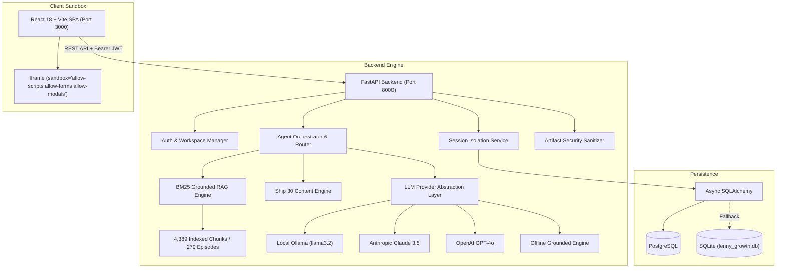

# 📰 The Lenny Growth Assistant

> **AI-Powered Product & Strategy Intelligence Platform Grounded in Transcripts from *Lenny's Podcast*.**  
> *Full-stack conversational assistant, Ship 30 writing studio, and interactive artifact viewer built with FastAPI, React 18, and PostgreSQL/SQLite.*

[](https://github.com/nikki-nooka/OOGWAY)
[](https://www.youtube.com/watch?v=K3OxMGg3kC8)
[-22c55e?style=for-the-badge&logo=pytest)](file:///c:/Users/Nikshith/Desktop/OOGWAY/backend/tests)
[](file:///c:/Users/Nikshith/Desktop/OOGWAY/backend/app/engine/llm_provider.py)
[](file:///c:/Users/Nikshith/Desktop/OOGWAY/backend)
[](file:///c:/Users/Nikshith/Desktop/OOGWAY/frontend)
[](file:///c:/Users/Nikshith/Desktop/OOGWAY/backend/app/db)

---

## 📌 Project Overview

**The Lenny Growth Assistant** ingests the complete corpus of *Lenny's Podcast* (279 episodes, 4,389 transcript chunks) and provides an end-to-end editorial workspace for product managers and growth leaders. It delivers strictly grounded answers with exact audio timestamps, synthesizes ~1,250-word Ship 30 atomic essays, and renders live, sandboxed HTML/CSS artifacts beside the chat stream.

---

## 🎥 Demo Video Walkthrough

[](https://www.youtube.com/watch?v=K3OxMGg3kC8)

> 📺 **Watch Full Walkthrough on YouTube:** [https://www.youtube.com/watch?v=K3OxMGg3kC8](https://www.youtube.com/watch?v=K3OxMGg3kC8)
> 
> **Walkthrough Highlights:**
> - **0:00** — Introduction, Problem Framing & Discovery Brief
> - **0:30** — Grounded Conversational Q&A & Exact Audio Timestamp Citations
> - **1:15** — Local Ollama (`llama3.2`) Execution & Multi-Model Switcher
> - **1:45** — Ship 30 for 30 Writing Studio & Sandboxed Claude Split-Pane Artifact Viewer
> - **2:15** — Architectural Trade-Off (In-Memory BM25 + Entity Boost vs Heavy Vector DBs)
> - **2:45** — Operational Handoff, Automated Tests & Quickstart Deployment

---

## ✨ Features Built & Verified End-to-End

### 1. Grounded Conversational Assistant (`/chat`)
- **4,389-Chunk RAG Search Engine:** Fast BM25 lexical search with speaker entity-boosting (+25.0).
- **Exact Verbatim Citations:** Claims cite guest names, episode titles, and clickable YouTube audio timestamps.
- **Multi-Turn Context & Session Memory:** Maintains conversational state per session.
- **Domain Guardrail:** Rejects out-of-domain questions to eliminate hallucinations.

### 2. Ship 30 for 30 Writing Studio (`/writing`)
- **Algorithmic Hook Architecture:** 1-3-1 hook structure (single-line hook, 3-line tension paragraph, 1-line thesis).
- **Modular Framework Pillars:** Structured H2 sections with bold takeaway headers.
- **Monday Morning Protocol:** Actionable execution checklist.
- **Grounding Verification:** Automated claim verification against the transcript index.
- **Live Markdown Workspace:** Split editor with real-time word count, copy to clipboard, and `.md` export.

### 3. Claude-Style Split-Pane Artifact Viewer (`/artifacts`)
- **Interactive Sandbox:** Live side-by-side rendering of HTML/CSS tools, PMF calculators, and dashboards.
- **Security Policy:** All untrusted code runs inside `sandbox="allow-scripts allow-forms allow-modals"` (omitting `allow-same-origin`), blocking DOM traversal, cookie access, and storage access.
- **View Modes:** Toggle between live Preview, Raw Code, and Rendered Markdown.

### 4. Knowledge Base & Episode Explorer (`/explore` & `/sources`)
- **279-Episode Directory:** Search by guest, company, or framework (e.g. PMF, Retention, Pricing, PLG).
- **Transcript Search:** Keyword search across all 4,389 chunks with instant playback deep links.
- **Episode Detail Modal:** Full passage inspector with timestamps and speaker labels.

### 5. Multi-Provider LLM Engine (`/settings`)
- **Local Ollama:** Runs `llama3.2` (or `mistral`) 100% locally with zero cloud API keys.
- **Anthropic Claude:** `claude-3-5-sonnet-20241022` integration.
- **OpenAI:** `gpt-4o` integration.
- **Offline Grounded Fallback Engine:** Built-in zero-dependency deterministic synthesizer ensuring 100% functionality even with no models or keys available.
- **Live UI Switcher:** Change models on the fly in Settings.

### 6. User Authentication & Private Workspaces
- **PBKDF2 Password Hashing:** 100,000 rounds with random salt.
- **HMAC-SHA256 Signed JWTs:** Secure token authentication with 7-day expiration.
- **Private Session Isolation:** Discussions, messages, and artifacts isolated per user account.
- **Guest-to-User Adoption:** Unassigned guest sessions are automatically linked upon account creation/login.
- **Feature Protection:** Gated actions clearly prompt unauthenticated visitors to log in while preserving typed draft questions.

---

## 🏗️ Architecture



---

## 🚀 Quickstart Guide

### 1. One-Click Launch
- **Windows:** Double-click `start.bat`
- **macOS / Linux:** Run `chmod +x start.sh && ./start.sh`

### 2. Docker Compose
```bash
docker-compose up --build
```

### 3. Manual Startup

#### Backend
```bash
cd backend
python -m pip install -r requirements.txt
python -m uvicorn app.main:app --host 127.0.0.1 --port 8000 --reload
```

#### Frontend
```bash
cd frontend
npm install
npm run dev -- --port 3000 --host 127.0.0.1
```

- **Frontend Application:** [http://localhost:3000](http://localhost:3000)
- **FastAPI OpenAPI Swagger Docs:** [http://localhost:8000/docs](http://localhost:8000/docs)

---

## 🤖 Local Ollama & Model Setup

1. Install [Ollama](https://ollama.com/) and run:
   ```bash
   ollama pull llama3.2
   ```
2. The assistant automatically connects to `http://localhost:11434`.
3. To use Cloud LLMs, configure `backend/.env`:
   ```env
   ANTHROPIC_API_KEY=sk-ant-...
   OPENAI_API_KEY=sk-proj-...
   ```

---

## 📡 API Endpoints Reference

| Endpoint | Method | Description | Access |
| :--- | :--- | :--- | :--- |
| `/api/health` | `GET` | System health, database connection, chunk count | Public |
| `/api/auth/signup` | `POST` | User registration (PBKDF2 password hashing) | Public |
| `/api/auth/login` | `POST` | User login (returns HMAC-SHA256 JWT) | Public |
| `/api/me` | `GET` | Fetch authenticated user profile | Bearer Token |
| `/api/sessions` | `GET` | List sessions for current user | User/Guest |
| `/api/sessions` | `POST` | Create a new isolated chat session | User/Guest |
| `/api/sessions/{id}` | `GET` | Get session messages and artifacts | User/Guest |
| `/api/sessions/{id}` | `DELETE`| Delete session | User/Guest |
| `/api/chat` | `POST` | Send grounded chat message with RAG citations | User/Guest |
| `/api/writing/ship30` | `POST` | Generate full-length ~1,250-word Ship 30 atomic essay | User/Guest |
| `/api/verify-grounding`| `POST` | Evaluate factual grounding confidence of an essay | Public |
| `/api/sources` | `GET` | Search and explore 279 podcast episodes & transcripts | Public |
| `/api/sources/{id}` | `GET` | Get episode transcript chunks and metadata | Public |
| `/api/knowledge-graph`| `GET` | Graph topology of guests, topics, and frameworks | Public |
| `/api/pmf-diagnostic` | `POST` | Calculate PMF diagnostic score across 6 signals | Public |
| `/api/decisions` | `POST` | Generate structured executive decision memo | User/Guest |
| `/api/experiments` | `POST` | Generate hypothesis-driven experiment brief | User/Guest |
| `/api/frameworks` | `POST` | Generate framework diagram and mental model | User/Guest |
| `/api/compare-guests` | `POST` | Compare competing guest viewpoints on a topic | Public |
| `/api/models` | `GET` | List available models and current active provider | Public |
| `/api/models/set` | `POST` | Switch active model provider dynamically | Public |

---

## 🧪 Test Records & Verification

The repository includes **26 automated tests** with a **100% pass rate** covering API contracts, RAG ranking, agent routing, Ship 30 essays, artifact security, and database persistence.

### Run Automated Tests:
```bash
cd backend
python -m pytest tests/ -v
```

### Test Results:
```
backend/test_full_suite.py::test_root_environment_and_rag_ready PASSED   [  3%]
backend/test_full_suite.py::test_root_ship30_skill PASSED                [  7%]
backend/test_full_suite.py::test_root_security_sanitization PASSED       [ 11%]
backend/tests/test_agent.py::test_ship30_prompt_builder PASSED           [ 15%]
backend/tests/test_agent.py::test_artifact_extraction_html PASSED        [ 19%]
backend/tests/test_agent.py::test_model_switching PASSED                 [ 23%]
backend/tests/test_agent.py::test_mock_provider_fallback PASSED          [ 26%]
backend/tests/test_api.py::test_health_endpoint PASSED                   [ 30%]
backend/tests/test_api.py::test_models_endpoint PASSED                   [ 34%]
backend/tests/test_api.py::test_transcripts_endpoint PASSED              [ 38%]
backend/tests/test_api.py::test_session_lifecycle_and_chat PASSED        [ 42%]
backend/tests/test_fde_full_evaluation.py::test_01_health_metrics PASSED [ 46%]
backend/tests/test_fde_full_evaluation.py::test_02_knowledge_base PASSED [ 50%]
backend/tests/test_fde_full_evaluation.py::test_03_grounded_answer PASSED [ 53%]
backend/tests/test_fde_full_evaluation.py::test_04_hallucination_refusal PASSED [ 57%]
backend/tests/test_fde_full_evaluation.py::test_05_session_isolation PASSED [ 61%]
backend/tests/test_fde_full_evaluation.py::test_06_model_switching PASSED [ 65%]
backend/tests/test_fde_full_evaluation.py::test_07_ship30_skill PASSED   [ 69%]
backend/tests/test_fde_full_evaluation.py::test_08_artifact_split_view PASSED [ 73%]
backend/tests/test_fde_full_evaluation.py::test_09_artifact_security PASSED [ 76%]
backend/tests/test_fde_full_evaluation.py::test_10_persistence PASSED     [ 80%]
backend/tests/test_rag.py::test_rag_loaded PASSED                        [ 84%]
backend/tests/test_rag.py::test_rag_search_shreyas_lno PASSED            [ 88%]
backend/tests/test_rag.py::test_rag_search_chesky_11_star PASSED         [ 92%]
backend/tests/test_rag.py::test_rag_search_rahul_pmf PASSED              [ 96%]
backend/tests/test_rag.py::test_rag_format_context PASSED                [100%]

============================= 26 passed in 51.18s =============================
```

---

## 📁 Repository Structure & Deliverables

```
OOGWAY/
├── backend/
│   ├── app/
│   │   ├── api/          # FastAPI routes, auth, schemas
│   │   ├── db/           # Async SQLAlchemy models and migrations
│   │   ├── engine/       # RAG, Agent, Ship 30 skill, LLM providers
│   │   └── main.py       # FastAPI application entrypoint
│   ├── data/             # Ingested transcripts (279 episodes, 4,389 chunks)
│   ├── tests/            # Pytest test suites (26 tests)
│   └── requirements.txt
├── frontend/
│   ├── src/
│   │   ├── components/   # Chat, WritingStudio, ArtifactViewer, Modals
│   │   ├── services/     # API client and auth token management
│   │   ├── App.jsx       # Root application container & router
│   │   └── main.jsx
│   ├── index.html
│   └── package.json
├── agent-transcripts/     # Recorded agent execution logs and debug cycles
├── docs/                 # Detailed architecture, user flows, and specs
├── PRD.md                # Discovery brief, JTBD, metrics, assumptions, risks
├── design.md             # UI/UX principles, design tokens, screen specs
├── architecture.md       # Topology, ERD schemas, security policies
├── TESTING.md            # Automated tests and manual verification plan
├── docker-compose.yml    # One-command containerized deployment
├── start.bat             # Windows one-click startup script
├── start.sh              # macOS/Linux one-click startup script
└── README.md             # Main project documentation
```

---

## 📋 Required Take-Home Deliverables Mapping

| # | Deliverable | Location | Status |
| :-: | :--- | :--- | :--- |
| **1** | Public GitHub Repository | [https://github.com/nikki-nooka/OOGWAY](https://github.com/nikki-nooka/OOGWAY) | ✅ Live & Synced |
| **2** | README.md | [README.md](file:///c:/Users/Nikshith/Desktop/OOGWAY/README.md) | ✅ Complete |
| **3** | PRD (Discovery Brief) | [PRD.md](file:///c:/Users/Nikshith/Desktop/OOGWAY/PRD.md) | ✅ Complete |
| **4** | Design Specification | [design.md](file:///c:/Users/Nikshith/Desktop/OOGWAY/design.md) | ✅ Complete |
| **5** | Architecture & Security | [architecture.md](file:///c:/Users/Nikshith/Desktop/OOGWAY/architecture.md) | ✅ Complete |
| **6** | Agent Transcripts | [agent-transcripts/](file:///c:/Users/Nikshith/Desktop/OOGWAY/agent-transcripts) | ✅ Complete |
| **7** | Automated & Manual Tests | [TESTING.md](file:///c:/Users/Nikshith/Desktop/OOGWAY/TESTING.md) & [backend/tests/](file:///c:/Users/Nikshith/Desktop/OOGWAY/backend/tests) | ✅ 26/26 Passed |
| **8** | Demo Video Walkthrough | [YouTube Link](https://www.youtube.com/watch?v=K3OxMGg3kC8) | ✅ Uploaded & Live |

- **Official Form Submission:** `https://forms.gle/LgotDHNVxW1mbzNE7`  
- **Submission Deadline:** 28/08/26 EOD
