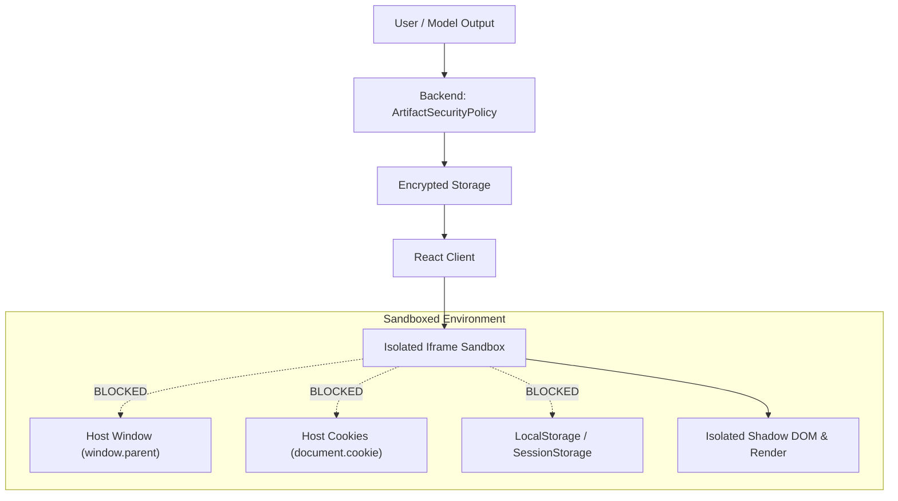

# Security Architecture & Artifact Sandbox Isolation
## Project: The Lenny Growth Assistant
**Document Version:** 1.0.0

---

## 1. Threat Model & Security Posture

The Lenny Growth Assistant generates executable HTML/CSS/JS artifacts directly from model outputs. Because model outputs may contain arbitrary user-influenced scripts or untrusted third-party code, the platform implements a **defense-in-depth isolation strategy**:



---

## 2. Multi-Layered Defense Architecture

### Layer 1: Backend Static Analysis (`ArtifactSecurityPolicy`)
Located at `backend/app/core/security.py`:
1. **DOM Traversal Stripping:** Scans for and strips `window.parent`, `window.top`, `window.opener`, and `parent.postMessage`.
2. **Credential & Storage Access Prevention:** Neutralizes calls to `document.cookie`, `localStorage`, `sessionStorage`, and `indexedDB`.
3. **Restricted Protocols:** Replaces `javascript:` and data URIs with safe equivalents.

### Layer 2: Frontend Iframe Sandbox
Located at `frontend/src/components/ArtifactViewer.jsx`:
- The rendered HTML is delivered via `<iframe srcDoc={sanitizedContent} sandbox="allow-scripts allow-forms allow-modals" />`.
- **Crucial Security Decision:** The `allow-same-origin` token is **deliberately omitted**. Without `allow-same-origin`, the browser treats the iframe as a completely unique origin (`null`), strictly barring access to the host app's DOM, cookies, session storage, or network auth headers.

### Layer 3: Safe Preview Security Banner
Every rendered HTML artifact displays a visible **Safe Sandbox Banner**:
```text
SAFE SANDBOX ACTIVE: Scripts restricted • Isolated origin • Sandbox enabled
```

---

## 3. Server-Side Credential Isolation
- API keys (`ANTHROPIC_API_KEY`, `OPENAI_API_KEY`, database credentials) are **strictly handled server-side**.
- No credentials or environment secrets are exposed in the client-side JavaScript bundle.
- CORS origins are restricted to configured development and production hosts (`settings.CORS_ORIGINS`).
