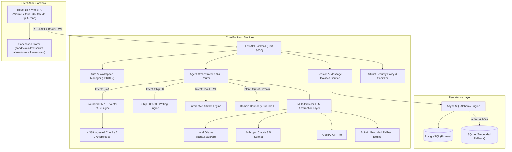
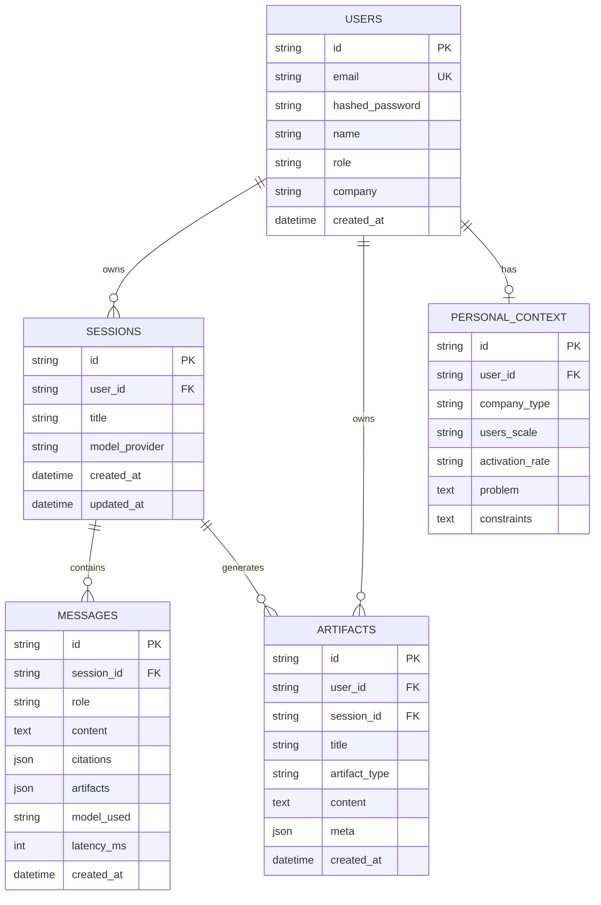

# System Architecture, Schemas & Security Specification
## Project: The Lenny Growth Assistant
**Document Version:** 1.0.0 (Production Release)  
**Theme:** Warm Editorial Intelligence • Split-Pane Architecture  

---

## 1. High-Level Architecture Topology



---

## 2. Database Schema (Relational ERD)



---

## 3. Grounded Retrieval Flow

```text
User Question
      ↓
Query Tokenization & Normalization
      ↓
Out-of-Domain Guardrail Check
      ↓ (Passed)
BM25 Inverted Index Search + Entity Boost (+25.0 guest match)
      ↓
Top-k Ranked Evidence Chunks (k = 4 to 8)
      ↓
Context Assembly with Audio Timestamps & Canonical YouTube URLs
      ↓
Model Provider Synthesis (Local Ollama / Cloud LLM / Grounded Fallback)
      ↓
Persisted Message + Citation Objects + Live Split View
```

---

## 4. API Endpoints Contract

| Endpoint | Method | Description | Auth Requirement |
| :--- | :--- | :--- | :--- |
| `/api/health` | `GET` | System health, database connection, and chunk count | Public |
| `/api/auth/signup` | `POST` | User registration with PBKDF2 password hashing | Public |
| `/api/auth/login` | `POST` | User login returning HMAC-SHA256 signed JWT | Public |
| `/api/me` | `GET` | Fetch authenticated user profile and settings | Bearer Token |
| `/api/sessions` | `GET` | List active sessions isolated by user | Optional (Guest/User) |
| `/api/sessions` | `POST` | Create a new isolated chat session | Optional (Guest/User) |
| `/api/chat` | `POST` | Execute grounded conversation with audio citations | Optional (Guest/User) |
| `/api/writing/ship30` | `POST` | Synthesize full-length ~1,250 word Ship 30 atomic essay | Optional (Guest/User) |
| `/api/sources` | `GET` | Search and explore 279 podcast episodes & transcripts | Public |
| `/api/knowledge-graph` | `GET` | Graph topology of guests, topics, and framework nodes | Public |
| `/api/pmf-diagnostic` | `POST` | Calculate PMF diagnostic score across 6 core signals | Public |
| `/api/models` | `GET` | List available model providers and current active model | Public |
| `/api/models/set` | `POST` | Switch active model provider dynamically | Public |

---

## 5. Security & Artifact Sandbox Specification

1. **Untrusted HTML/JS Isolation:**
   - Evaluated code is injected into an isolated `<iframe>` element.
   - Enforces `sandbox="allow-scripts allow-forms allow-modals"`.
   - **Crucially omits `allow-same-origin`**, preventing generated scripts from accessing `window.parent`, `document.cookie`, `localStorage`, or authentication tokens.
2. **Server-Side Sanitization:**
   - `ArtifactSecurityPolicy.sanitize_html()` checks against disallowed patterns (`javascript:`, `vbscript:`, `window.top`, `document.cookie`, `localStorage.`).
3. **Zero Secrets in Codebase:**
   - All credentials loaded dynamically via environment variables with `.env.example` safe defaults.

