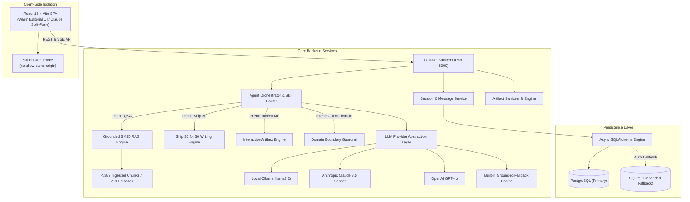
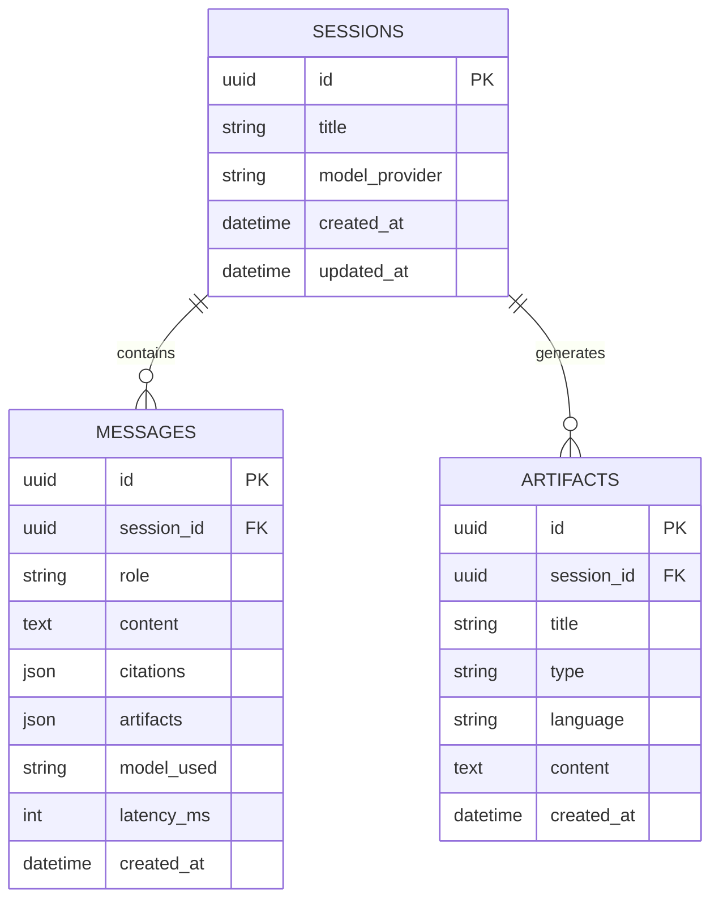

# System Architecture, Schemas & Security Specification
## Project: The Lenny Growth Assistant
**Document Version:** 1.0.0 (Production Release)  
**Theme:** Warm Editorial Intelligence

---

## 1. High-Level Architecture Topology



---

## 2. Database Schema (Relational ERD)



---

## 3. Grounded Retrieval Flow

```text
User Question
      ↓
Query Tokenization & Normalization
      ↓
Out-of-Domain Guardrail Check
      ↓ (Passed)
BM25 Inverted Index Search + Entity Boost (+25.0 guest match)
      ↓
Top-k Ranked Evidence Chunks (k = 4)
      ↓
Context Assembly with Audio Timestamps & Canonical URLs
      ↓
Model Provider Synthesis
      ↓
Persisted Message + Citation Objects + Live Split View
```
