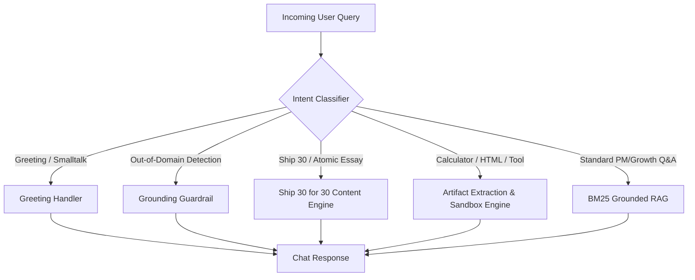

# Agent Routing & Specialized Skills Architecture
## Project: The Lenny Growth Assistant
**Document Version:** 1.0.0

---

## 1. Intent Detection & Routing Topology

Rather than relying on one monolithic generic prompt, the system deploys an **Agent Orchestrator** with discrete skill routing:



---

## 2. Dedicated Skill Specifications

### 2.1 Ship 30 for 30 Writing Skill (`Ship30Skill`)
Located at `backend/app/engine/ship30_skill.py`:
- **Hook (1-3-1 Cadence):** 1 opening line of contrarian tension, 3 context lines explaining common PM pitfalls, 1 thesis payoff line.
- **3-4 Modular H2 Pillars:** Each contains high-density bold principles, verbatim quotes from Lenny's guests, and bulleted execution steps.
- **Monday Morning Protocol:** Step-by-step checklist for immediate team execution.
- **1-Sentence Golden Takeaway:** Memorable quotable summary.

### 2.2 Interactive Artifact Engine (`ArtifactEngine`)
Located at `backend/app/engine/artifact_engine.py`:
- Detects ````html ```` blocks generated by the LLM.
- Analyzes and categorizes artifacts (e.g. *Retention Curve Simulator*, *LNO Prioritization Matrix*, *PMF Scorecard*, *Onboarding Funnel Simulator*).
- Applies `ArtifactSecurityPolicy` sanitization and packages metadata for split-screen rendering.

### 2.3 Grounding Guardrail
Located at `backend/app/engine/agent.py`:
- Rejects non-PM domains and prevents hallucination of fake citations.
