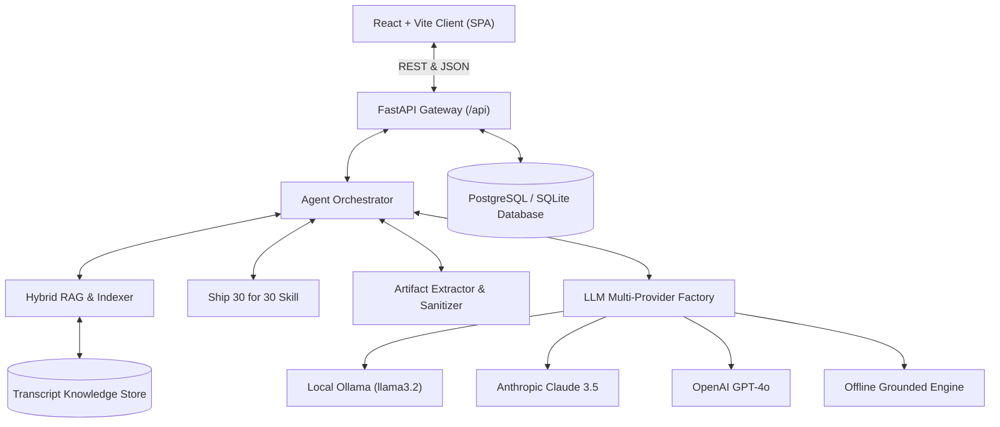
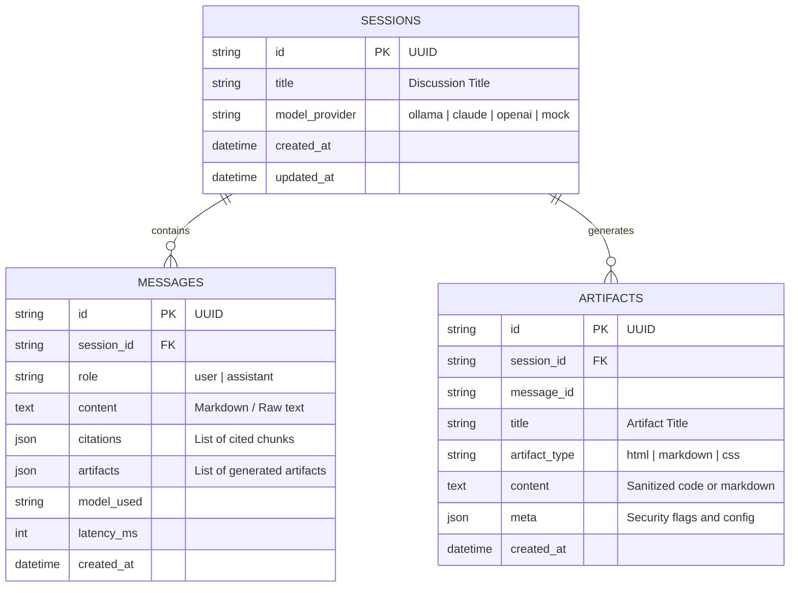

# System Architecture & Technical Specification
## Project: The Lenny Growth Assistant
**Author:** Forward Deployed Engineering Lead  
**Document Version:** 1.0.0  

---

## 1. High-Level Architecture

The system utilizes a modern, decoupled three-tier architecture designed for low latency, reproducible deployment, and maximum grounding fidelity:



---

## 2. Component Boundaries & Responsibilities

### 2.1 Backend Core (FastAPI)
- **`app/main.py`**: ASGI app setup, lifespan DB connection, CORS headers, API routing.
- **`app/api/routes.py`**: REST API endpoints for `/chat`, `/sessions`, `/models`, `/transcripts`, `/health`.
- **`app/api/schemas.py`**: Pydantic v2 validation contracts for all requests and responses.

### 2.2 Intelligence & Retrieval Layer
- **`app/engine/rag.py`**:
  - Inverted index construction with BM25 term weighting ($k_1 = 1.5, b = 0.75$) + exact entity boosting.
  - Chunk metadata preserving guest name, bio, episode title, audio timestamp, and canonical URL.
- **`app/engine/ship30_skill.py`**:
  - Encodes the 1-3-1 atomic hook formula, H2 modular frameworks, bulleted checklists, and one-sentence takeaways.
- **`app/engine/artifact_engine.py`**:
  - Automatically isolates ````html ... ```` blocks, executes `ArtifactSecurityPolicy` sanitization, and extracts interactive component metadata.
- **`app/engine/llm_provider.py`**:
  - `OllamaProvider`: Talks directly to local Ollama daemon (`http://localhost:11434`).
  - `ClaudeProvider`: Talks to Anthropic Claude 3.5 Sonnet.
  - `OpenAIProvider`: Talks to OpenAI GPT-4o.
  - `MockGroundedProvider`: Deterministic offline synthesizer ensuring continuous testability even without cloud keys or running Ollama instances.

---

## 3. Database Schema & Persistence Layer

The persistence engine uses **SQLAlchemy 2.0 (Async)** with automatic dual-engine capability (PostgreSQL when `DATABASE_URL` is set; seamless fallback to SQLite).

### 3.1 Entity Relationship Diagram



---

## 4. Security & Artifact Isolation Strategy

When rendering generated HTML/CSS artifacts, the platform applies a defense-in-depth isolation model:

1. **Backend Pattern Stripping (`ArtifactSecurityPolicy`):**
   - Regex scanning removes attempts to traverse the DOM (`window.parent`, `window.top`) or access browser storage (`document.cookie`, `localStorage`, `sessionStorage`, `indexedDB`).
2. **Frontend Sandboxed Iframe:**
   - Evaluator runs code in `<iframe sandbox="allow-scripts allow-forms allow-modals" srcdoc={sanitizedHtml} />`.
   - The absence of `allow-same-origin` ensures the rendered snippet cannot access the host application's origin, cookies, or local state.

---

## 5. API Contracts

| Endpoint | Method | Description |
| :--- | :--- | :--- |
| `/api/health` | `GET` | System health, database connection, active model, and loaded transcripts. |
| `/api/models` | `GET` | List available models (Local Ollama, Claude, OpenAI, Mock) & readiness status. |
| `/api/models/set` | `POST` | Dynamically switches the active global model. |
| `/api/sessions` | `GET` | List all conversation sessions with metadata. |
| `/api/sessions` | `POST` | Create a new session. |
| `/api/sessions/{id}` | `GET` | Fetch full message history, citations, and artifacts for a session. |
| `/api/sessions/{id}` | `DELETE`| Delete a session and its associated messages/artifacts. |
| `/api/chat` | `POST` | Execute chat request, invoke RAG/Skills, generate artifacts, and return citations. |
| `/api/transcripts` | `GET` | Search and browse all ingested Lenny Podcast transcripts. |
