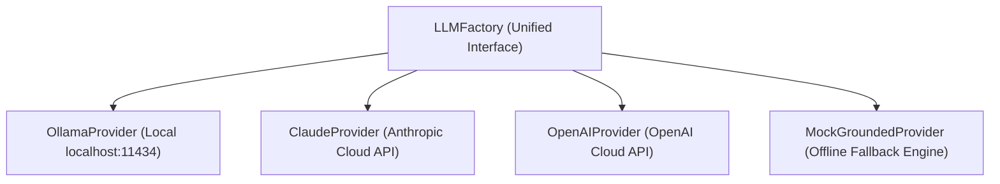

# AI Model Providers & Abstraction Layer
## Project: The Lenny Growth Assistant
**Document Version:** 1.0.0 (Production Release)

---

## 1. Multi-Provider Abstraction Architecture

The application is built upon a uniform `BaseLLMProvider` abstraction interface in `backend/app/engine/llm_provider.py`. The business logic (RAG retrieval, Ship 30 generation, and Artifact creation) does not depend on any specific cloud vendor.



---

## 2. Exact Model Configurations & Specifications

### 2.1 🦙 Local Ollama (Mandatory Demo Layer)
- **Model Identifier:** `llama3.2` (Default) or `llama3.1`
- **Configuration Variable:** `OLLAMA_MODEL=llama3.2`
- **Host Endpoint:** `http://localhost:11434/api/chat`
- **Options Configured:** `temperature=0.3`, `num_predict=2048`
- **Zero Cloud Leakage:** All inference runs on the evaluator's local hardware without transmitting data outside the host.

---

### 2.2 🟣 Anthropic Claude 3.5 Sonnet
- **Model Identifier:** `claude-3-5-sonnet-20241022`
- **Configuration Variables:**
  - `ANTHROPIC_API_KEY=sk-ant-api03-...`
  - `ANTHROPIC_MODEL=claude-3-5-sonnet-20241022`
- **Endpoint:** `https://api.anthropic.com/v1/messages`
- **Parameters:** `max_tokens=4096`, `anthropic-version=2023-06-01`
- **Capability Focus:** Long-form strategy memos, deep reasoning, and pristine markdown formatting.

---

### 2.3 🟢 OpenAI GPT-4o (Omni)
- **Model Identifier:** `gpt-4o`
- **Configuration Variables:**
  - `OPENAI_API_KEY=sk-proj-...`
  - `OPENAI_MODEL=gpt-4o`
- **Endpoint:** `https://api.openai.com/v1/chat/completions`
- **Parameters:** `temperature=0.3`
- **Capability Focus:** Fast multimodal understanding, low-latency generation, and interactive HTML/JS code logic.

---

### 2.4 ⚡ Built-in Offline Grounded Engine (`MockGroundedProvider`)
- **Model Identifier:** `grounded_offline_engine`
- **Configuration Variable:** `DEFAULT_LLM_PROVIDER=mock`
- **Mechanism:** Pure-Python deterministic synthesizer embedded directly in the backend.
- **Data Source:** Directly reads and formats retrieved BM25 transcript chunks from the 4,389 indexed library chunks.
- **Zero-Setup Guarantee:** Runs 100% offline with zero external software installations, zero API keys, and zero rate limits.

---

## 3. Resilience & Automatic Failover

```mermaid
graph TD
    UserRequest["User Request / Model Selection"] --> TrySelected{"Selected Provider Available?"}
    TrySelected -->|Yes| Exec["Execute Model Call"]
    TrySelected -->|No (Key Missing / Timeout / 401)| Fallback["Failover to Offline Grounded Engine"]
    Exec -->|Network / API Error| Fallback
    Fallback --> Success["Return Grounded Answer + Citations (200 OK)"]
```

When an external provider fails (e.g. invalid API key, model timeout, or network disconnection), the provider handler catches the exception and immediately invokes `MockGroundedProvider`, guaranteeing that the user and evaluator never experience a `500 Server Error`.
