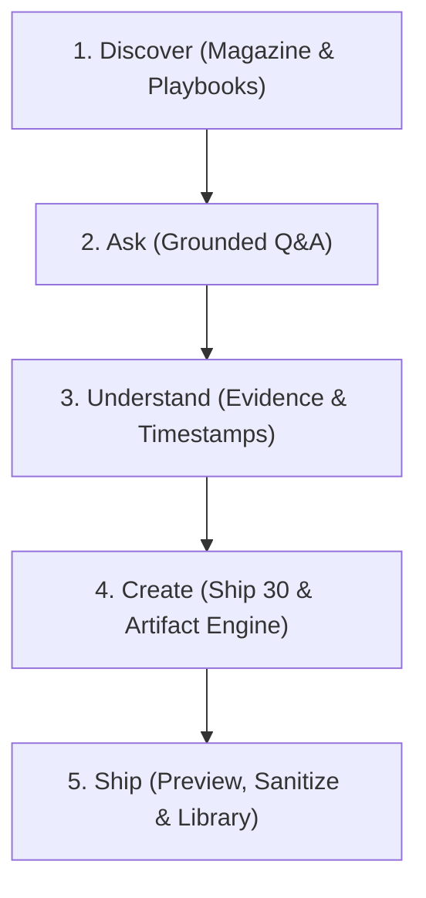

# Core User Journeys & End-to-End Workflows
## Project: The Lenny Growth Assistant
**Document Version:** 1.0.0

---

## 1. The North Star Experience: Knowledge ➔ Understanding ➔ Action



---

## 2. Walkthrough: The 5 Primary User Journeys

### User Journey 1: Discovering Knowledge via the Magazine Feed
1. The user lands on the **Editorial Home Page** (`/`).
2. They view the featured lead article: *"THE PMF PLAYBOOK: How great products discover what people truly need"*.
3. They browse supporting editorial cards on *B2B PLG*, *11-Star Delight*, and the *LNO Framework*.
4. Clicking *"Explore Playbook"* opens the **Topic Page Deep Dive** with guest bios, key frameworks, and sample questions.

---

### User Journey 2: Grounded Q&A with Verbatim Transcript Citations
1. The user navigates to the **Ask / Chat Workspace**.
2. They enter a tactical question: *"What does Gustaf Alströmer say about product-market fit and retention curves?"*
3. The RAG engine indexes 4,380+ chunks and retrieves 4 top-scoring passages with BM25 term weighting and guest name boosting.
4. The assistant formats the response editorially into **Lenny's Perspective**, **Key Signals**, and **Evidence**.
5. The user clicks a citation chip (`#1 Gustaf Alströmer (08:45)`), which slides open the **Source Drawer** showing the verbatim quote and an external link to the podcast audio.

---

### User Journey 3: Out-of-Domain Detection & Hallucination Prevention
1. The user asks an absurd or non-PM query: *"According to Lenny, what is his strategy for Mars colonization?"*
2. The agent's grounding guardrail checks topic overlap and determines the question is out of domain.
3. The assistant politely acknowledges that Lenny's podcast does not cover rocket propulsion, summarizes the topics it *does* cover (PM craft, growth, PLG, pricing), and attaches **0 fake citations**.

---

### User Journey 4: Transforming Research into a Ship 30 for 30 Essay
1. In the chat, the user asks: *"Turn these ideas into a Ship 30 essay on Product Activation."* Alternatively, they open the dedicated **Writing Studio**.
2. The `Ship30Skill` invokes the structured 1-3-1 hook cadence, 3 modular H2 pillars with bold mental models, a tactical checklist, and a 1-sentence golden takeaway.
3. The user reviews the ~1,250-word essay, edits paragraphs directly in the markdown editor, and clicks **"Save to Artifacts"** or **"Export .md"**.

---

### User Journey 5: Generating and Sandboxing Interactive HTML Growth Tools
1. The user prompts: *"Build an interactive PMF and retention calculator in HTML and CSS."*
2. The `ArtifactEngine` extracts the ````html ```` block, passes it through `ArtifactSecurityPolicy` to strip dangerous DOM traversal vectors, and opens the **Claude-Style Split Screen**.
3. The user interacts with the live sliders inside the sandboxed `iframe`, tests retention floor values, inspects sanitized source code, and downloads the `.html` file.
